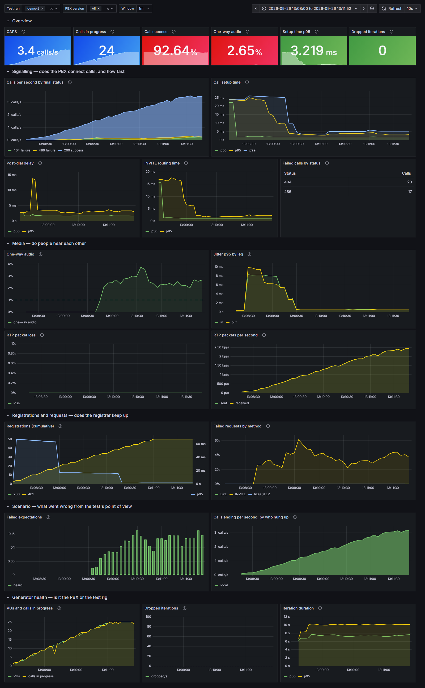

# xk6-sip

k6 extension `k6/x/sip` for load testing PBXs and SIP servers with scripted
subscribers: each VU owns real SIP devices that register, call each other
through the system under test and check what arrives on the other side.

Status: REGISTER, INVITE/CANCEL/BYE with digest auth; RTP with G.711
(PCMU/PCMA), RFC 3550 loss/jitter, RFC 4733 DTMF and audio detection;
hold/resume, blind and attended transfer (REFER, Replaces), PRACK (100rel)
and session timers.

## Compatibility

| xk6-sip | k6 | Go |
|---|---|---|
| v0.1.x – v0.3.x | v2.x (built and tested with v2.3.0) | 1.26+ |

## Build and run

```sh
xk6 build v2.3.0 --with github.com/Dmitry-Fedotov-Dev/xk6-sip=. --output bin/k6
go build -o bin/testpbx ./cmd/testpbx

bin/testpbx -addr 127.0.0.1:5070 -users 200 -csv examples/subscribers.csv
bin/k6 run examples/call.js
```

Timings below a millisecond are only reliable on Linux: Go's clock on
Windows ticks in ~0.5 ms steps.

## Script API

```js
import sip from 'k6/x/sip';

sip.options({ registerRate: 50, expectTimeout: '30s' }); // init context, optional

// No network in init; REGISTER is sent on first use and refreshed.
// Unknown string fields (ext, onk, gw_num, ...) are the device's numbers.
const ua1 = new sip.Device({ device: 'phone1', registrar: 'sip:pbx:5060',
  user: 'a@domain', pass: 'secret', expires: 180, ext: '701' });

export default function () {
  const out = ua1.call({ callee: ua2, aon: 'ext' });   // returns at once
  const inc = ua2.expectCall({ caller: ua1, aon: 'ext', timeout: '5s' }); // Call or false
  inc.accept();
  out.expectConnected();        // true/false
  inc.hangup();                 // CANCEL, reject or BYE depending on state
  out.expectDisconnected();
}

export function teardown() { sip.shutdown(); } // unregister everything
```

Only `expect*` methods and `isHeard` wait, so one VU can drive both ends of a
call. They return `false` on timeout instead of throwing.

Full reference with every option and an example per method:
[docs/](docs/sources/k6/next/javascript-api/k6-x-sip/_index.md) (k6-docs format).

| Module | Description |
| --- | --- |
| `new sip.Device(options)` | SIP subscriber; `device`, `registrar`, `proxy`, `user`, `authUser`, `pass`, `expires`, `register`, `displayName`, `sessionExpires`, `prack`, media options; any other field is a number (`ext`, `onk`...) |
| `sip.options(options)` | `localIP`, `registerRate`, `ringTimeout` (3m), `expectTimeout` (30s), `trace`, `deviceTag`, media defaults |
| `sip.audio(data)`, `sip.tone(freq?, dbfs?)` | audio sources for calls |
| `sip.shutdown()` | hang up, unregister and close all devices; call in `teardown()` |

| Device | Description |
| --- | --- |
| `call({callee, aon, timeout, id, headers, ...media})` | send INVITE, return the Call at once (or `false`) |
| `expectCall({caller, aon, timeout})` | wait for a matching incoming call (or `false`) |
| `register()`, `isRegistered()` | REGISTER now / last result |
| `identity(key)`, `id` | a number of the device / its name |
| `destroy()` | hang up, unregister, close; next use starts it again |

| Call | Description |
| --- | --- |
| `accept()`, `reject(code?, reason?)`, `hangup()` | answer, decline (603), end in any state |
| `expectRinging/Connected/Disconnected(timeout?)` | wait for the state |
| `state()`, `status()`, `remote()`, `callId`, `id` | calling/ringing/connected/ended, final status, other party |
| `howCompleted()` | `{endedBy, status, reason, duration}` once ended |
| `trace()` | SIP ladder of this leg |
| `codec()`, `isHeard(timeout?)`, `mediaStats()` | media checks and RTP statistics |
| `sendDTMF(digits, ms?)`, `expectDTMF(digits, timeout?)`, `receivedDTMF()` | RFC 4733 DTMF |
| `hold()`, `unhold()`, `isOnHold()`, `isRemoteHold()` | re-INVITE hold |
| `transfer(dest, aon?)`, `attendedTransfer(consult)` | REFER, REFER with Replaces |
| `expectTransferred(timeout?)`, `expectReferredCall(timeout?)` | transfer result / call placed on REFER |

### Debugging a call

`call.trace()` returns the SIP ladder of one call leg: every message the
device sent (`->`) or received (`<-`) for this call, with the time since the
first one. Print it when a check fails:

```js
const out = ua1.call({ callee: '1999' });
if (!check(out, { 'connected': (c) => c.expectConnected('5s') })) {
  console.warn(out.trace());
}
```

```
+0.000s  -> INVITE sip:1999@test.local SIP/2.0
+0.001s  <- SIP/2.0 407 Proxy Authentication Required
+0.002s  -> INVITE (with credentials)
+0.003s  <- SIP/2.0 404 Not Found
```

Only start lines are kept, so tracing is cheap under load.
`sip.options({ trace: true })` keeps whole messages with headers and SDP.
`howCompleted()` tells who ended the call and why, and `callId` finds the
call in PBX logs.

### Media

Every call sends RTP by default: a 1 kHz tone, so the far end can check
that audio arrives. Streams are paced by a shared scheduler (500 VUs /
~1000 concurrent streams / 50k packets/s use ~0.6 CPU core on Linux).

```js
const hello = sip.audio(open('./hello.wav', 'b')); // 16-bit PCM, 8 kHz, mono
const ua = new sip.Device({ ..., codecs: 'PCMA,PCMU', audio: hello });

const out = ua1.call({ callee: ua2, media: false }); // signalling only
inc.isHeard('3s');                // audio from the other side arrived
out.codec();                       // 'PCMA'
out.sendDTMF('1#');                // RFC 4733
inc.expectDTMF('1#', '5s');
out.mediaStats();                  // {codec, sent, received, lost, jitter, heard, dtmf}
```

Media options (`media`, `codecs`, `audio: sip.audio(...) | sip.tone(freq, dbfs) | 'silence'`,
`heardLevel`) can be set in `sip.options()`, per Device and per call.

### Hold and transfer

```js
inc.hold();                         // re-INVITE a=sendonly; out.isRemoteHold() === true
inc.unhold();

inc.transfer(ua3);                  // blind: REFER to ua3's ext (or '703', or (ua3, 'onk'))
inc.expectTransferred('10s');        // final NOTIFY says 2xx

const consult = ua2.call({ callee: ua3 }); /* ... answered ... */
inc.attendedTransfer(consult);      // REFER with Replaces
```

PBXs that handle REFER themselves (B2BUA, hosted PBX) keep the transferee's
call and re-INVITE its media; when REFER reaches the endpoint instead, the
device places the new call itself (`call.expectReferredCall()`) and answers
INVITEs with Replaces automatically.

Device options: `prack: true` sends 180 reliably (RFC 3262) when the caller
supports it (reliable 18x from the PBX are always PRACKed);
`sessionExpires: 1800` requests session timers (RFC 4028; refreshes and
422 are handled, a call whose peer stops refreshing is hung up).

## Functional tests

`examples/functional/` holds call-flow tests (basic call with DTMF, hold,
blind and attended transfer) for one VU and one iteration: any failed step
stops the scenario, k6 exits non-zero and writes a JUnit report.

```sh
bin/testpbx -addr 127.0.0.1:5070 -users 3
bin/k6 run -e JUNIT=report.xml examples/functional/attended-transfer.js
# against a real PBX:
bin/k6 run -e REGISTRAR=sip:pbx:5060 -e A_USER=701@pbx -e A_PASS=... -e A_EXT=701 ... examples/functional/hold.js
```

## Metrics

| metric | type | tags |
|---|---|---|
| `sip_requests` | counter | method, status |
| `sip_request_duration` | trend | method, status |
| `sip_failed_requests` | rate | method (401/407 challenges are not failures) |
| `sip_call_setup_time` | trend | INVITE → 200 |
| `sip_post_dial_delay` | trend | INVITE → first 18x |
| `sip_call_success` | rate | status |
| `sip_call_duration` | trend | ended_by |
| `sip_invite_delivery_time` | trend | caller's INVITE → callee receives it |
| `sip_registrations` | counter | |
| `sip_expect_failed` | counter | expect |
| `rtp_packets_sent` / `_received` / `_lost` | counter | codec, direction (per call leg) |
| `rtp_jitter` | trend | RFC 3550 interarrival jitter per leg |
| `rtp_audio_heard` | rate | legs that received audio; < 1 means one-way audio |
| `sip_calls` | counter | phase: answered, ended (answered − ended = calls in progress) |
| `sip_call_results` | counter | result (success, failure, cancelled), status |
| `rtp_legs` | counter | codec, direction, heard (true/false) |

`sip.options({ deviceTag: true })` adds a `device` tag to all of them. The last
three counters exist for dashboards: rates and trend percentiles are cumulative
over the whole run in most outputs, counters can be turned into per-window rates.

## Monitoring

`monitoring/` holds Prometheus and Grafana with a ready dashboard: calls per
second by status, setup time, post-dial delay, INVITE routing time, one-way
audio, jitter, RTP loss, registrations, failed expectations and generator
health.

```sh
docker compose -f monitoring/docker-compose.yml up -d

K6_PROMETHEUS_RW_SERVER_URL=http://localhost:9091/api/v1/write \
K6_PROMETHEUS_RW_TREND_AS_NATIVE_HISTOGRAM=true \
bin/k6 run -o experimental-prometheus-rw \
  --tag testid=run-1 --tag pbx_version=4.2.1 examples/call.js
```

Open http://localhost:3001 (no login; the stack is for local use and binds to
127.0.0.1). Native histograms give percentiles per time window, so a
degradation in the middle of a long run is visible. `testid` and
`pbx_version` tags let you pick a run and compare PBX versions.



## Layout

- `engine/` – SIP core, independent of k6 (sipgo transactions + own dialog layer)
- `media/` – RTP: G.711, scheduler, statistics, DTMF, audio detection
- `testpbx/`, `cmd/testpbx` – minimal registrar/B2BUA for tests and examples
- repo root – the k6 adapter
